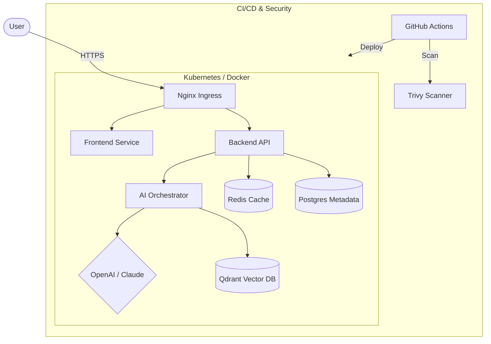

# 🚀 Knowledge Intelligence System (KIS)

[](https://github.com/bittush8789/Knowledge-Intelligence-System/actions)
[](https://opensource.org/licenses/MIT)
[](https://www.python.org/downloads/)
[](https://kubernetes.io/)

**Knowledge Intelligence System (KIS)** is a production-grade, enterprise-scale AI platform designed for intelligent document processing and knowledge retrieval. Built with a modular microservices architecture, it leverages Large Language Models (LLMs) and Vector Databases to provide accurate, context-aware answers from your private documents.

---

## 🌟 Key Features

- **🧠 Multi-Agent RAG**: Advanced Retrieval-Augmented Generation workflows using **LangGraph**.
- **⚡ Modern Frontend**: High-performance, responsive UI built with **HTML5, CSS3, and JavaScript**.
- **🛡️ DevSecOps Integrated**: Automated security scanning with **Trivy** and **Semgrep**.
- **☁️ Cloud Native**: Fully containerized and ready for **AWS EKS** (Cloud) or **KIND** (Local K8s).
- **📈 Observability**: Pre-configured for **Prometheus** metrics and **Grafana** dashboards.
- **🏗️ Infrastructure as Code**: Automated environment provisioning using **Terraform**.

---

## 🏗️ System Architecture



---

## 📁 Project Structure

```text
.
├── backend/            # FastAPI/Flask API & AI Logic
├── frontend/           # Static HTML/CSS/JS Frontend
├── ai/                 # LangGraph Agents & Prompts
├── k8s-simple/         # Kubernetes Manifests
├── docker/             # Dockerfiles & Compose
├── infra/              # Terraform IaC Files
├── docs/               # Detailed Setup & User Guides
└── scripts/            # Automation & Utility Scripts
```

---

## 🚀 Getting Started

### 1. Local Development (No Docker)
```bash
# Clone the repository
git clone https://github.com/bittush8789/Knowledge-Intelligence-System.git
cd Knowledge-Intelligence-System

# Setup Environment
cp .env.example .env  # Add your API keys here

# Install Dependencies
pip install -r requirements.txt

# Run Backend
python backend/main.py
```

### 2. Local Kubernetes (KIND)
```bash
# Create Cluster
kind create cluster --name ai-platform

# Deploy App
cd k8s-simple
bash deploy-all.sh
```

---

## 🛡️ Security & DevSecOps

This project adheres to enterprise security standards:
- **Image Scanning**: Every build is scanned by **Trivy**.
- **SAST**: Code is analyzed by **Semgrep** for vulnerabilities.
- **Non-Root Containers**: Services run as non-privileged users.
- **Secret Management**: Environment variables handled via K8s Secrets.

---

## 📊 Monitoring & Observability

- **Prometheus**: Collects application and cluster metrics.
- **Grafana**: Visualizes health, latency, and token usage.
- **Loki**: Centralized logging for all microservices.

---

## 🤝 Contributing

We welcome contributions! Please see our [Contribution Guide](docs/CONTRIBUTING.md) for details.

1. Fork the Project
2. Create your Feature Branch (`git checkout -b feature/AmazingFeature`)
3. Commit your Changes (`git commit -m 'Add some AmazingFeature'`)
4. Push to the Branch (`git push origin feature/AmazingFeature`)
5. Open a Pull Request

---

## 📄 License

Distributed under the MIT License. See `LICENSE` for more information.

---

## 📧 Contact

**Bittu Sharma** - [@bittush8789](https://github.com/bittush8789)  
**Project Link**: [https://github.com/bittush8789/Knowledge-Intelligence-System](https://github.com/bittush8789/Knowledge-Intelligence-System)

---
<p align="center">Made with ❤️ for the AI Community</p>
