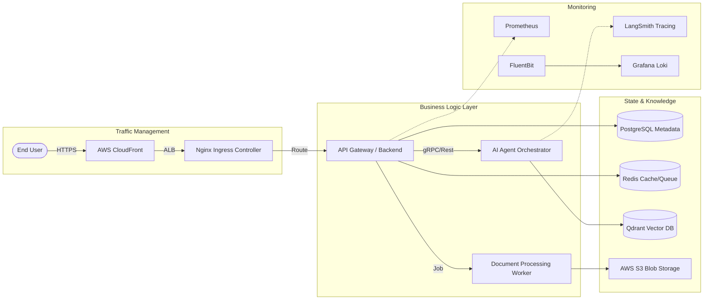

# 🚀 Knowledge Intelligence System (KIS) - Enterprise Edition

<p align="center">
  
  
  
  
</p>

---

## 📖 Table of Contents
- [Overview](#-overview)
- [System Architecture](#-system-architecture)
- [Enterprise Features](#-enterprise-features)
- [Tech Stack](#-tech-stack)
- [Project Layout](#-project-layout)
- [Deployment Strategy](#-deployment-strategy)
- [DevSecOps Lifecycle](#-devsecops-lifecycle)
- [Getting Started](#-getting-started)
- [Monitoring & SLIs](#-monitoring--slis)

---

## 🧐 Overview
The **Knowledge Intelligence System (KIS)** is a cloud-native, AI-powered knowledge management platform. It transforms unstructured data (PDFs, Docs, Text) into an interactive knowledge base using **Agentic RAG** (Retrieval-Augmented Generation). Designed for high availability, scalability, and security, KIS follows the **Twelve-Factor App** methodology.

---

## 🏗️ System Architecture (Enterprise Grade)

### High-Level Design


---

## ✨ Enterprise Features
- **Agentic Workflows**: Multi-step reasoning agents powered by **LangGraph**.
- **Self-Healing Infrastructure**: Kubernetes-managed pod health with automated rollouts.
- **Zero-Trust Security**: mTLS communication and non-root distroless containers.
- **Auto-Scaling**: Horizontal Pod Autoscaler (HPA) based on custom metrics.
- **GitOps Driven**: Fully automated deployments via GitHub Actions and Terraform.

---

## 🛠️ Tech Stack
| Category | Technology |
| :--- | :--- |
| **Backend** | FastAPI (Python 3.11+), LangChain, LangGraph |
| **Frontend** | Static HTML5/CSS3/JS (High Speed, Zero JS overhead) |
| **Databases** | PostgreSQL (Relational), Qdrant (Vector), Redis (Cache) |
| **Infrastructure** | Terraform, AWS EKS, KIND (Local) |
| **DevSecOps** | Trivy, Semgrep, GitHub Actions |
| **Monitoring** | Prometheus, Grafana, Loki |

---

## 📁 Project Layout
```text
.
├── backend/            # Business Logic & API Endpoints
├── frontend/           # Modern UI (Static Assets)
├── ai/                 # Agentic RAG Workflows & Prompts
├── infra/
│   ├── terraform/      # AWS EKS, VPC, RDS Modules
│   └── k8s-simple/     # Kubernetes Core Manifests
├── docs/
│   ├── architecture/   # ADRs & Design Diagrams
│   ├── setup-guides/   # Tool Installation Documents
│   └── career/         # Resume & Interview Prep
├── scripts/            # CI/CD & Automation Utility
└── docker/             # Production-grade Dockerfiles
```

---

## 🚀 Deployment Strategy

### 🛡️ Production (AWS EKS)
1. **Provision**: `terraform apply` (EKS, VPC, IAM).
2. **Deploy**: `kubectl apply -f infra/k8s-simple/`.
3. **Verify**: Check ALB LoadBalancer status.

### 💻 Local (KIND)
```bash
# Spin up local cluster
kind create cluster --config infra/k8s-simple/kind-config.yaml
# Deploy platform
bash scripts/deploy-local.sh
```

---

## 📊 Monitoring & SLIs
We monitor the following Service Level Indicators (SLIs):
- **Latency**: AI response time < 2s (P95).
- **Availability**: 99.9% uptime for the API Gateway.
- **Throughput**: 100+ concurrent document processing tasks.
- **Cost**: Real-time token usage tracking via custom dashboards.

---

## 📄 License
This project is licensed under the MIT License - see the [LICENSE](LICENSE) file for details.

---
<p align="center">
  <b>Built for Scale. Secured for Enterprise.</b><br>
  Developed by <b>Bittu Sharma</b>
</p>
