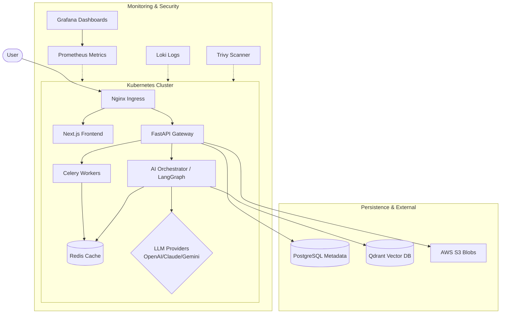

# System Architecture

```mermaid
graph TD
    User([User]) --> Ingress[Nginx Ingress]
    
    subgraph K8s_Cluster [Kubernetes Cluster]
        Ingress --> Frontend[Next.js Frontend]
        Ingress --> Backend[FastAPI Gateway]
        
        Backend --> AI_Service[AI Orchestrator / LangGraph]
        Backend --> Task_Queue[Celery Workers]
        
        Task_Queue --> Redis[(Redis Broker)]
        AI_Service --> Redis[(Redis Cache)]
        
        AI_Service --> LLM_API{LLM Providers\nOpenAI/Claude/Gemini}
    end
    
    subgraph Storage_Layer [Persistence & External]
        Backend --> Postgres[(PostgreSQL Metadata)]
        AI_Service --> Qdrant[(Qdrant Vector DB)]
        Backend --> S3[AWS S3 Blobs]
    end
    
    subgraph Observability [Monitoring & Security]
        Prometheus[Prometheus Metrics] -.-> K8s_Cluster
        Grafana[Grafana Dashboards] --> Prometheus
        Loki[Loki Logs] -.-> K8s_Cluster
        Trivy[Trivy Scanner] -.-> K8s_Cluster
    end
```
