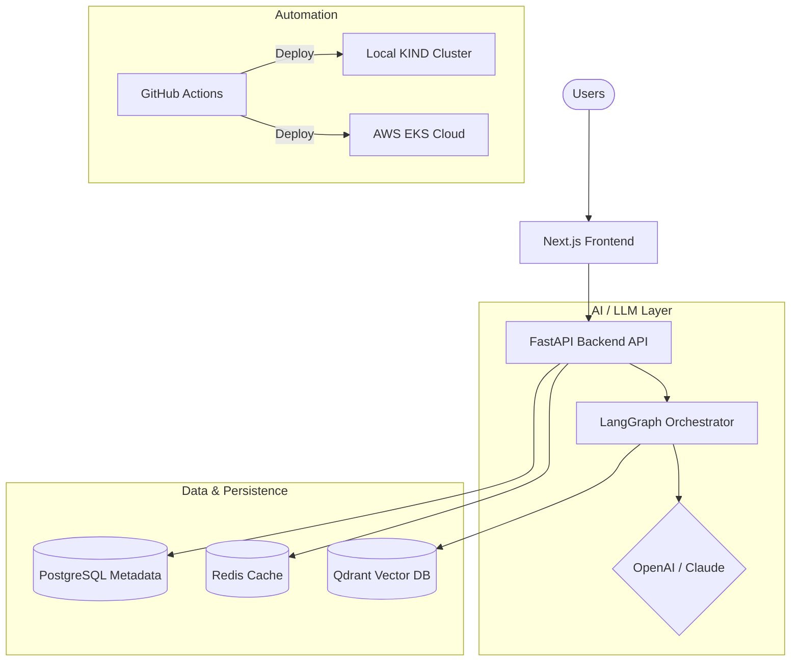

# Simple System Architecture

```mermaid
graph TD
    Users([Users]) --> Frontend[Next.js Frontend]
    Frontend --> Backend[FastAPI Backend API]
    
    subgraph AI_Layer [AI / LLM Layer]
        Backend --> Orchestrator[LangGraph Orchestrator]
        Orchestrator --> LLM{OpenAI / Claude}
    end
    
    subgraph Databases [Data & Persistence]
        Backend --> Postgres[(PostgreSQL Metadata)]
        Backend --> Redis[(Redis Cache)]
        Orchestrator --> Qdrant[(Qdrant Vector DB)]
    end
    
    subgraph DevOps [Automation]
        GHA[GitHub Actions] --> |Deploy| KIND[Local KIND Cluster]
        GHA --> |Deploy| EKS[AWS EKS Cloud]
    end
```
